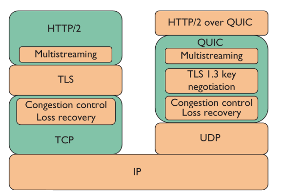
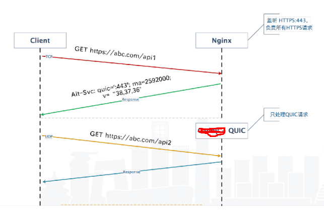

​    

    QUIC官网 https://quicwg.org/
    HTTP3中文文档：https://http3-explained.haxx.se/zh/ 
    
    QUIC Discovery 
        https://docs.google.com/document/d/1i4m7DbrWGgXafHxwl8SwIusY2ELUe8WX258xt2LFxPM/edit#
        
    Quic不同版本的实现 https://github.com/quicwg/base-drafts/wiki/Implementations
    
    https://halfrost.com/quic_start/
    关于QUIC的各种尝试 https://debug.fanzheng.org/post/about-quic.html
    腾讯云 QUIC协议初探-iOS实践  https://cloud.tencent.com/developer/article/1071825   

Chromium 源码检索： https://cs.chromium.org/chromium/src/

#### 编译工具gn 、ninja

参考 ： 

https://www.chromium.org/developers/gn-build-configuration

https://chromium.googlesource.com/chromium/src/+/master/tools/gn/docs

```sh
Install depot_tools
cd ~
git clone https://chromium.googlesource.com/chromium/tools/depot_tools.git
#配置环境变量，例如  export PATH="$PATH:/path/to/depot_tools"
export PATH=$PATH:/root/depot_tools
```

#### Chromium Cronet 

 开发文档 https://chromium.googlesource.com/chromium/src/+/refs/heads/master/components/cronet

- C[ronet android](https://chromium.googlesource.com/chromium/src/+/refs/heads/master/components/cronet/android)

编译 android 库(Ubuntu 18.04)：https://chromium.googlesource.com/chromium/src/+/refs/heads/master/docs/android_build_instructions.md

android 开发文档  https://developer.android.com/guide/topics/connectivity/cronet

android 示例代码 https://chromium.googlesource.com/chromium/src/+/refs/heads/master/components/cronet/android

[https://github.com/GoogleChromeLabs/cronet-sample/ ](https://github.com/GoogleChromeLabs/cronet-sample/)

````sh
#Ubuntu 18.04
mkdir chromium_android && cd chromium_android
nohup fetch --nohooks android & 	
cd src
echo "target_os = [ 'android' ]" >> ../.gclient	
gclient sync   #(This is the only difference between fetch android and fetch chromium.)
build/install-build-deps-android.sh	
gclient runhooks
（1）
	./components/cronet/tools/cr_cronet.py gn --out_dir=out/Cronet
    gn clean out/Cronet
	ninja -C out/Cronet cronet_package 
（2）Release 版本  ***编译 ****
  Cronet build instructions https://chromium.googlesource.com/chromium/src/+/master/components/cronet/
  2.1 
   $ ./components/cronet/tools/cr_cronet.py gn --release
  2.2 #you can run gn args {out_dir} and modify arguments in the editor that comes up.	
  	$gn args out/Release  #会修改 out/Release/args.gn
  		target_cpu="arm"	 #  对应的  armeabi-v7a
  		target_cpu="arm64"	 #  对应的  
  		target_cpu="x86"	 #  模拟器用
  2.3 
  $ ninja -C out/Release cronet_package
````


- C[ronet ios](https://chromium.googlesource.com/chromium/src/+/refs/heads/master/components/cronet/ios/)

编译ios 库（Mac）：https://github.com/chromium/chromium/blob/master/docs/mac_build_instructions.md

ios 示例代码：https://chromium.googlesource.com/chromium/src/+/refs/heads/master/components/cronet/ios/

```sh
#MAC
System requirements
- A 64-bit Mac running 10.12.6 or later.
- Xcode 10.0+.
- The current version of the JDK (required for the Closure compiler).

$ git clone https://chromium.googlesource.com/chromium/tools/depot_tools.git
 $ export PATH="$PATH:/path/to/depot_tools"
 $ mkdir chromium && cd chromium
 $ fetch ios
 $ cd src
 $ ./components/cronet/tools/cr_cronet.py gn --release
$ ninja -C out/Release-iphonesimulator cronet_package
ninja -C out/Release-iphonesimulator cronet_unittests_ios

```

####  Cronet Native

```sh
#
mkdir chromium_linux && cd chromium_linux
nohup  fetch --nohooks chromium &
cd src
./build/install-build-deps.sh  --no-chromeos-fonts
gclient runhooks

#编译流程
#components\cronet\BUILD.gn
gn gen out/Default  #产生ninja构建所需的各个模块的ninja文件。
ninja -C out/Default cronet_sample
ninja -C out/Default cronet_sample_q043_get
ninja -C out/Default cronet_sample_q043_post

ninja -C out/Default cronet_unittests cronet_tests  # Build both test suites.
./out/Default/cronet_unittests  # Run unit tests.
./out/Default/cronet_tests  # Run the integration tests.


out/Default/cronet/libcronet.78.0.3872.0.so
out/Default/cronet/include/bidirectional_stream_c.h
out/Default/cronet/include/cronet_c.h
out/Default/cronet/include/cronet_export.h
out/Default/cronet/include/cronet.idl_c.h
```

```json
#QUIC 参数

{
    "QUIC": {
        "quic_version": "QUIC_VERSION_43",
        "idle_connection_timeout_seconds": 30,
        "race_cert_verification": false,
        "support_ietf_format_quic_altsvc": true,
        "enable_socket_recv_optimization": true,
        "connection_options": "TIME,TBBR,REJ",
        "client_connection_options": "TBBR,1RTT"
    }
}
```

| 字段         | 值                               | 参考                                                         |
| ------------ | -------------------------------- | ------------------------------------------------------------ |
| quic_version | QUIC_VERSION_43、QUIC_VERSION_39 | https://cs.chromium.org/chromium/src/net/quic/quic_http_stream.cc |
|              |                                  |                                                              |
|              |                                  |                                                              |


------

#### Chromium net 

[quic_client ](https://cs.chromium.org/chromium/src/net/tools/quic/) ： https://cs.chromium.org/chromium/src/net/tools/quic/

[epoll_quic_client](https://cs.chromium.org/chromium/src/net/third_party/quiche/src/quic/tools/) ：https://cs.chromium.org/chromium/src/net/third_party/quiche/src/quic/tools/

```sh
#net/BUILD.gn

#编译流程
gn gen out/Default  #产生ninja构建所需的各个模块的ninja文件。
ninja -C out/Default quic_server 
ninja -C out/Default quic_client

ninja -C out/Default net:epoll_quic_client
ninja -C out/Default net:epoll_quic_server

#方式一 cache: quic_server epoll_quic_server

cd /home/fanshuang/cronet
mkdir quic-data
cd quic-data
wget -p --save-headers https://www.example.org
cd /home/fanshuang/cronet
export LD_LIBRARY_PATH=$LD_LIBRARY_PATH:/home/fanshuang/cronet/lib
nohup ./quic_server \
  --quic_response_cache_dir=./quic-data/www.example.org \
  --certificate_file=./certs/out/leaf_cert.pem \
  --key_file=./certs/out/leaf_cert.pkcs8 --port=25001 &
  
#方式二 proxy: quic_server epoll_quic_server  
nohup ./quic_server --quic_proxy_backend_url=http://127.0.0.1:25080 --certificate_file=./y.play.360kan.com.crt --key_file=./y.play.360kan.com.pkcs8 --port=443 -mode=proxy &
nohup ./ 

# --v=1 显示详细日志
./quic_client --host=127.0.0.1 --port=25001 https://www.example.org/114m.mp4 --quic_version=Q039
./epoll_quic_client --host=127.0.0.1 --port=25001 --v=1 https://www.example.org --quic_version=Q039

```






